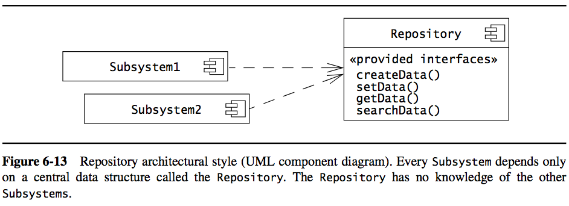
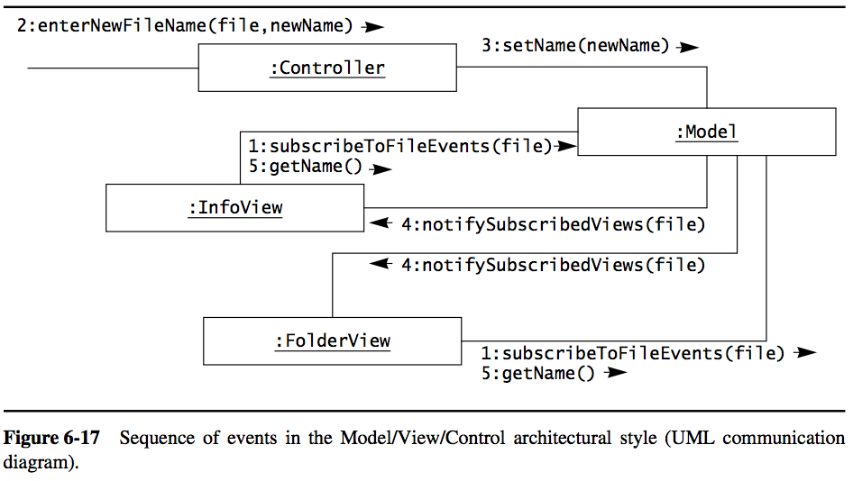

##### Decomposing a system into several subsystems.

#### Subsystem
---
well-defined **interfaces**, encapsulating state and behavior of contained classes

- characterized by services it provides
- “a directory containing all the files that implement all classes in this subsystem"
- independent, serve a certain goal
- contain one of more classes
- common ones: 
	- XXInterface: provides interaction with XX
	- XXManagement: mange XX (create, edit, remove…)
	- Notification: provides communications between different subsystems
	
#### Class
---
- specify attributes and behavior for a certain type of object
- make objects distinguishable

#### Coupling
---
number of dependencies between 2 subsystems

- if a subsystem were to be changed, how much the subsystem coupled with it has to be changed
- should be as **little** as possible, do not depend on others too much!!

##### example: how to decoupling between DB and other subsystem
	

- _Storage_ shields _Database_ so that if _Database_ needs to be changed, other subsystems would not be impacted
- additional complexity: use it only if the subsystem subjects to constant change

#### Cohesion
---
number of dependencies within a subsystem.

- objects that are related to each other and perform similar tasks
- should be as **high** as possible
- [heuristics] keep at most 5~9 subsystems/level, 5~9 services/subsystem

##### example

- only one dependency of association between 2 subsystem

#### Architectural styles
---

##### 1. Repository

Several subsystems access and modify a single data structure (central repository). 

- typically used for database management systems, such as payroll system, bank system, etc
- Application with database that are constantly changing and having complex data process tasks
- The repository is the bottleneck of performance and modifiability

##### 2. Model/View/Controller

Classify subsystems into three types.

1. Model: domain knowledge
2. View: ability to display to user
3. Controller: manage the sequence of interactions with the user

- _Model_ is built to be independent from _Controller_ and _View_
- There could be multiple _Controller_ interact with _Model_ and multiple _View_ to display data from _Model_
- Any change in _Model_ is propagated to _View_ through **subscribe/notify** protocol
- [Intuition] user interfaces (i.e. _View_ and _Controller_) are much more often subject to change than domain knowledge is.
- Mostly suited for a system with multiple views of the same model, e.g. a website with different access such as computer, tablet and smartphone

##### 3. Client/Server

One subsystem, server, provides services to multiple instances of other subsystems, clients.

- An information system with a central database
- Client is responsible for interacting with users
- Example is different web browsers accessing web server

##### 4. Peer-to-peer

Subsystems can act both as client or as servers. 

- subsystem could either request or provide services.
- possible deadlocks during communications

##### 5. Three tier

Organize subsystems into three layers

1. Interface layer: all boundary objects users could interact with
2. Application layer: all control and entity objects 
3. Storage layer: storage, retrieval and query of persistent objects

- Different from MVC