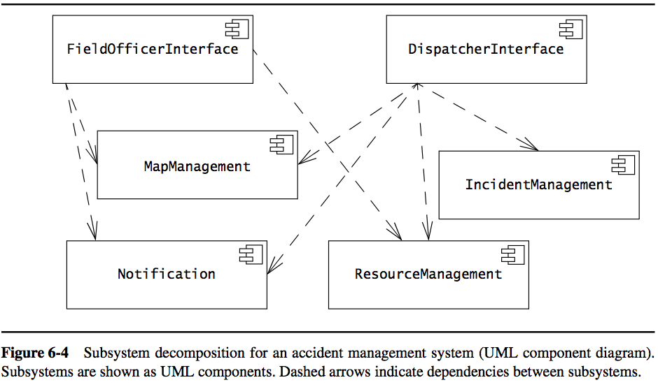
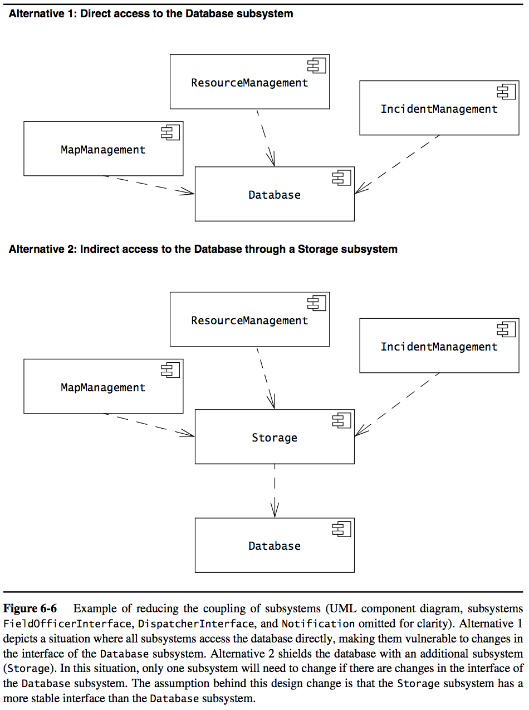
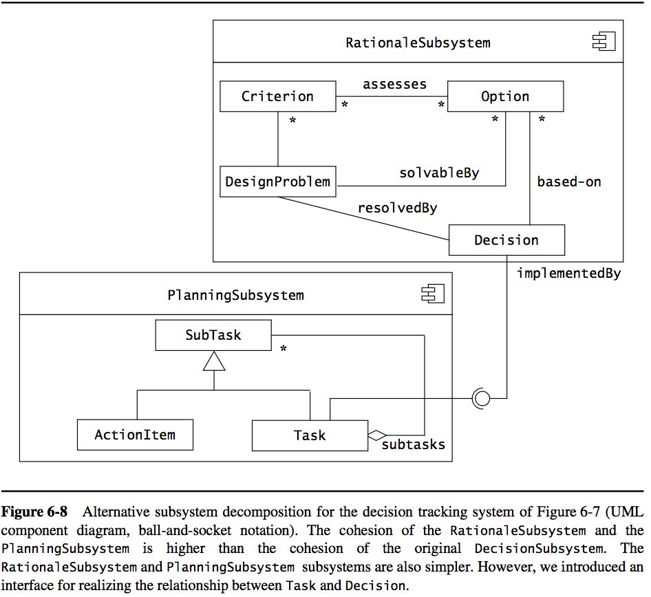

##### Decomposing a system into several subsystems.

#### Subsystem
well-defined **interfaces**, encapsulating state and behavior of contained classes

- characterized by services it provides
- “a directory containing all the files that implement all classes in this subsystem"
- independent, serve a certain goal
- contain one of more classes
- common ones: 
	- XXInterface: provides interaction with XX
	- XXManagement: mange XX (create, edit, remove…)
	- Notification: provides communications between different subsystems
	
#### Class
- specify attributes and behavior for a certain type of object
- make objects distinguishable

#### Coupling
number of dependencies between 2 subsystems

- if a subsystem were to be changed, how much the subsystem coupled with it has to be changed
- should be as **little** as possible, do not depend on others too much!!

##### example: how to decoupling between DB and other subsystem
	

- _Storage_ shields _Database_ so that if _Database_ needs to be changed, other subsystems would not be impacted
- additional complexity: use it only if the subsystem subjects to constant change

#### Cohesion
number of dependencies within a subsystem.

- objects that are related to each other and perform simialr tasks
- should be as **high** as possible
- [heuristics] keep at most 5~9 subsystems/level, 5~9 services/subsystem

##### example

- only one dependecy of association between 2 subsystem

